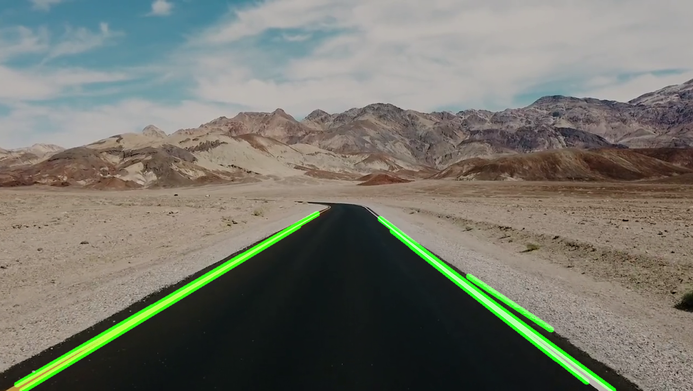

# Computer Vision With OpenCV

Computer vision with OpenCV involves the utilization of the Open Source Computer Vision Library (OpenCV) to empower machines with visual perception capabilities akin to human vision. OpenCV provides a comprehensive set of tools and functions that enable tasks such as image and video processing, object detection and tracking, facial recognition, and more. Its wide array of pre-built algorithms and techniques, ranging from basic image filtering to advanced machine learning-based methods, makes it a cornerstone for various applications, including robotics, autonomous vehicles, medical imaging, and surveillance systems. By bridging the gap between the digital realm and the visual world, OpenCV plays a pivotal role in advancing technologies that rely on harnessing the power of computer vision.

## OpenCV Operations

1. Import Image

```python
import cv2

# import the image
img = cv2.imread("images/messi5.jpg", 0) # 0's mean grayscale

# visualization
cv2.imshow("first image", img)
k = cv2.waitKey(0) & 0xFF # -> wait the key

if k == 27: # wsc -> mean space
    cv2.destroyAllWindows()
elif k == ord('s'):
    cv2.imwrite('images/messi_gray.png', img) # -> save the image
    cv2.destroyAllWindows() # -> close the all windows
```

2. Import Video

```python
import cv2
import time

# get video name
video_name = "images/MOT17-04-DPM.mp4"

# capture, cap
cap = cv2.VideoCapture(video_name)

print("weight: ", cap.get(3))
print("height: ", cap.get(4))

if cap.isOpened() == False:
    print("warning")

while True:

    ret, frame = cap.read() # -> frame is images in video, ret is transaction success

    if ret == True:
        time.sleep(0.01) # to reduce video speed
        cv2.imshow("video",frame)

    else: break

    if cv2.waitKey(1) & 0xFF == ord("q"):
        break

cap.release() # -> stop capture
cv2.destroyAllWindows()
```

3. Camera and Video Recording

```python
import cv2

# capture

cap = cv2.VideoCapture(0) # zero = default camera

width = int(cap.get(cv2.CAP_PROP_FRAME_WIDTH))
height = int(cap.get(cv2.CAP_PROP_FRAME_HEIGHT))

print(width, height)

# record video

writer = cv2.VideoWriter("images/first-video.mp4", cv2.VideoWriter_fourcc(*"DIVX"), 20, (width,height))

# VideoWriter_fourcc -> 4-character codec code used to compress videos (*"DIVX" for windows) 20 is fps

while True:
    ret, frame = cap.read()
    cv2.imshow("video", frame)

    # save
    writer.write(frame)

    if cv2.waitKey(1) & 0xFF == ord("q") : break

cap.release() # stop capture
writer.release()
cv2.destroyAllWindows()
```

4. Resize and Crop

```python
import cv2

img = cv2.imread("images/Lenna_(test_image).png")
print("image shape: ", img.shape)
cv2.imshow("origin", img)


# resize the image
img_resize = cv2.resize(img, (800,800))
print("resized img shape: ", img_resize.shape)
cv2.imshow("resized", img_resize)

# crop the image
img_crop = img[:200, 0:300] # -> height width
cv2.imshow("croped image: ", img_crop)
cv2.waitKey()
```

5. Shape and Text

```python
cv2.line(img, (0,0), (512,512),(0,255,0), 3) # (images, start point, end point, color, thickness)

cv2.rectangle(img, (0,0),(255,255), (255,0,0), cv2.FILLED) # # (images, start point, end point, color)

cv2.circle(img, (300,300), 50, (0,0,255), cv2.FILLED) # (images, start point, r, color)

cv2.putText(img, "image", (350,350), cv2.FONT_HERSHEY_COMPLEX, 1, (255,255,255)) # (images, name, start point, font, thickness, color)
```

6. Merging the Images

```python
import cv2
import numpy as np

img = cv2.imread("images/Lenna_(test_image).png")
cv2.imshow("Original", img),

hor = np.hstack((img,img))
cv2.imshow("horizontal", hor)

ver = np.vstack((img,img))
cv2.imshow("vertical", ver)


k = cv2.waitKey(0) & 0xFF # -> wait the key

if k == 27: # wsc -> mean space
    cv2.destroyAllWindows()
```

7. Perspective Distortion
```python
import cv2
import numpy as np

img = cv2.imread("images/card.png")
cv2.imshow("original", img)

width = 400
height = 500

pts1 = np.float32([[230,1],[1,472],[540,150],[338,617]])
pts2 = np.float32([[0,0],[0,height],[width,0],[width,height]])

matrix = cv2.getPerspectiveTransform(pts1,pts2)
print(matrix)

img_out = cv2.warpPerspective(img, matrix, (width, height))
cv2.imshow("original", img_out)


k = cv2.waitKey(0) & 0xFF # -> wait the key

if k == 27: # wsc -> mean space
    cv2.destroyAllWindows()
```

8. Blending

``` python
# blending picture = alpha*img1 + beta*img2
blended = cv2.addWeighted(src1=img1, alpha=0.3, src2=img2, beta=0.7, gamma=0)
cv2.imshow("blanded image",blended)
```

9. Image Thresholding

```python
# threshold
_, threh_img = cv2.threshold(img, thresh=60, maxval=255, type=cv2.THRESH_BINARY) # between 60 and 255 will make it white
cv2.imshow("threhed_image", threh_img)

# adaptive thresholding is used in order not to spoil the whole
# (maxval, adaptive method, threshold type, blocksize, _)
threh_img2 = cv2.adaptiveThreshold(img, 255, cv2.ADAPTIVE_THRESH_MEAN_C, cv2.THRESH_BINARY, 11, 8)
cv2.imshow("threhed_image2", threh_img2)
```
10. Blurring (Smooting)

Image blur is achieved by applying a low-pass filter to the image.

Useful for removing noise. removes high frequency content (noise, edges) from the image.

OpenCV provides three main blur techniques.
- Average Blur
- Gaussian Blur
- Median Blur

### Average Blur

It is done by wrapping an image with a normalized box filter.
Takes the average of all pixels under the kernel area and replaces this average with the central element.

### Gaussian Blur

This method uses gaussian kernel instead of box filter.
The width and height of the core, which must be positive and unique, are specified.
sigmaX and sigmaY, we must specify the standard deviation in the X and Y directions.

### Median Blur

Takes the median of all pixels under the kernel area and the central element is replaced by that median value.
Its is very wary of salt and pepper noise.

```python
# average blurr
dts2 = cv2.blur(img, ksize=(3,3))
cv2.imshow("average blurr",dts2)

gaussiaNoisyImage = gaussianNoise(img2)
cv2.imshow("gaussionNoisyImage", gaussiaNoisyImage)

# gauss blurr
gb = cv2.GaussianBlur(gaussiaNoisyImage, ksize=(3,3), sigmaX=7) # if sigmaY do not assign the sigmaY = sigmaX
cv2.imshow("with gauss blurr",gb)

# median blurr
spImage = saltPepperNoise(img2)
cv2.imshow("SP median blurr", spImage)

# median blurr
mb2 = cv2.medianBlur(spImage.astype(np.float32), ksize=3)
cv2.imshow("with median blurr",mb2)
```

11. Morphological

Morphological operations such as erosion, expansion, opening, closing and morphological gradient.

Erosion: its basic idea is just like erosion, eroding the boundaries of the foreground object.

Dilation: the opposite of erosion, it increases the white area in the image.

Opening: erosion + dilation, is used to prevent noise.

Closing: The opposite of opening, dilation + erosion. used to cover small holes in foreground objects or small black dots on the object.

Morphological Gradient: It is the difference between dilation and erosion of an image.

```python 
# erosion
kernel = np.ones((5,5), dtype=np.uint8)
result = cv2.erode(img, kernel, iterations=1)
cv2.imshow("erosion",result)

# dilation
result2 = cv2.dilate(img, kernel, iterations=1)
cv2.imshow("dilation",result2)

# opening
opening = cv2.morphologyEx(noise_img.astype(np.float32), cv2.MORPH_OPEN, kernel)
cv2.imshow("opening",opening)

# closing
closing = cv2.morphologyEx(black_noise_img.astype(np.float32), cv2.MORPH_CLOSE, kernel)
cv2.imshow("closing", closing)

# morphological gradient
gradient = cv2.morphologyEx(img, cv2.MORPH_GRADIENT, kernel)
cv2.imshow("gradient", gradient)
```

12. Gradient

An image gradient is a directional change in intensity or color in an image. Used for edge detection.

```python
#  output depth 
# x gradient
sobelx = cv2.Sobel(img, ddepth = cv2.CV_16S, dx = 1, dy = 0, ksize = 5) # depth is precision of each pixel
plt.figure()
plt.imshow(sobelx, cmap = "gray")
plt.axis("off")
plt.title("sobel X")
plt.show()


# y gradient 
sobely = cv2.Sobel(img, ddepth = cv2.CV_16S, dx = 0, dy = 1, ksize = 5) # depth is precision of each pixel
plt.figure()
plt.imshow(sobely, cmap = "gray")
plt.axis("off")
plt.title("sobel Y")
plt.show()


# Laplacian  gradient
laplacian = cv2.Laplacian(img, ddepth = cv2.CV_16S)
plt.figure()
plt.imshow(laplacian, cmap = "gray")
plt.axis("off")
plt.title("Laplacian")
plt.show()
```

13. Histogram

An image histogram is a type of histogram that functions as a graphical representation of the tonal distribution in a digital image.

Contains the number of pixels for each tonal value.

By looking at the histogram for a particular image, the tonal distribution can be understood.
```python
# histogram equalization (increase the contrast)
img = cv2.imread("images/hist_equ.jpg", 0)
plt. figure(), plt.imshow(img, cmap="gray"), plt.show()

img_hist = cv2.calcHist([img], channels = [0], mask = None, histSize = [256], ranges = [0,256]) 
plt.figure(), plt.plot(img_hist), plt.show()

# expanded the narrow region that was stuck between 120-200 to the range of 0-255.

eq_hist = cv2.equalizeHist(img)
plt. figure(), plt.imshow(eq_hist, cmap="gray"), plt.show()

eq_img_hist = cv2.calcHist([eq_hist], channels = [0], mask = None, histSize = [256], ranges = [0,256]) 
plt.figure(), plt.plot(eq_img_hist), plt.show()
```

## OpenCV Projects

1. Hand Tracking

https://developers.google.com/mediapipe/solutions/vision/hand_landmarker


2. Finger Counting


3. Pose Estimation 

https://developers.google.com/mediapipe/solutions/vision/pose_landmarker/


4. Personal Trainer


5. Face Detection 

https://developers.google.com/mediapipe/solutions/vision/face_detector/


6. Face Mesh

https://developers.google.com/mediapipe/solutions/vision/face_landmarker#get_started


7. Parking Space Counter


8. Road Line Detection




9. Sleep Detection


